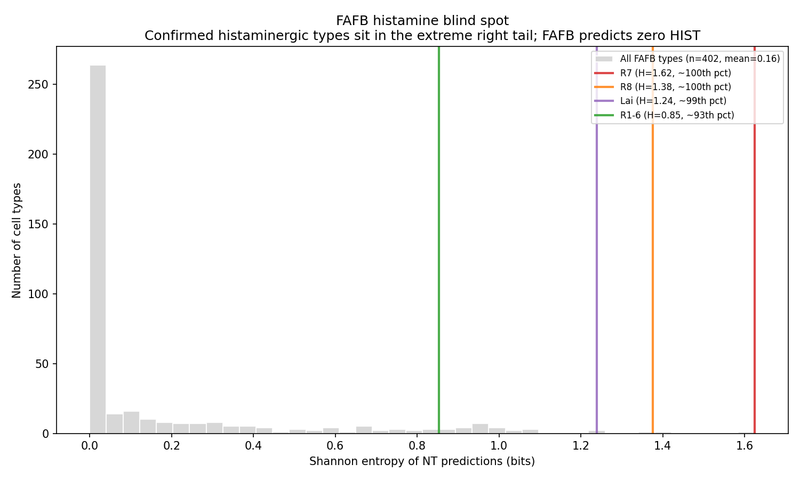
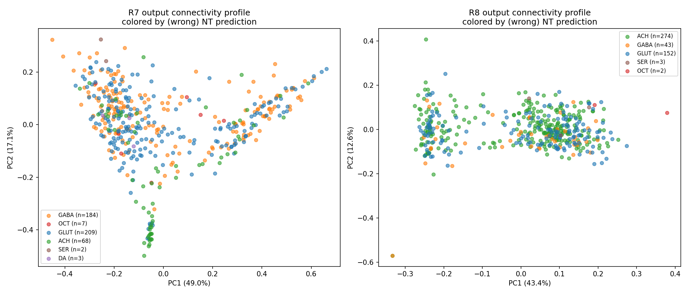
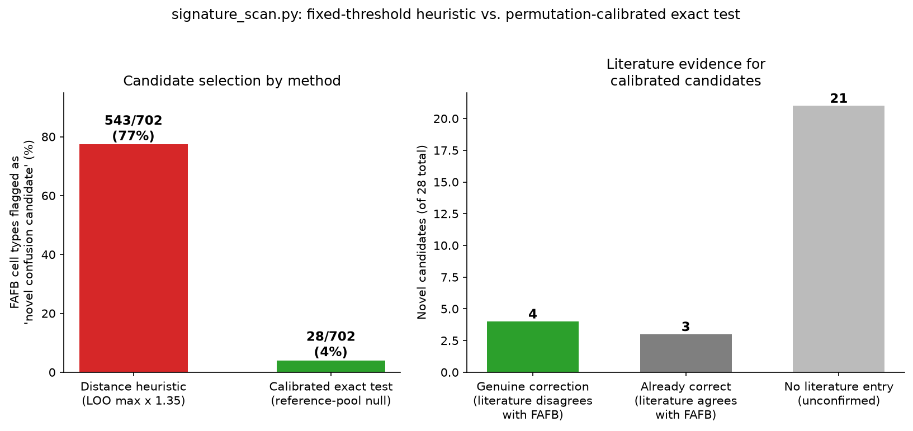

# Neurotransmitter Consistency Within Cell Types Across FlyWire Connectomes

Tests whether neurons sharing a cell type label agree on their predicted neurotransmitter, as Dale's law would suggest — and traces the strongest outliers to their actual cause.

## Headline result

An unbiased screen of 402 FAFB cell types found only 2 statistically significant outliers by neurotransmitter inconsistency: **R7 and R8**, the fly's photoreceptors. Cross-dataset comparison against MCNS then revealed why: **FAFB's neurotransmitter classifier (Eckstein et al., Cell 2024) only predicts six neurotransmitters, and histamine is not one of them** — despite photoreceptors being canonically histaminergic. As a result, every histaminergic neuron in FAFB gets force-classified into one of the six other categories, and which category varies neuron to neuron, producing exactly the high-entropy signal this project was built to detect.

This was cross-checked against MCNS (whose classifier does include histamine): R7, R8, Lai, and R1-6 all sit in the extreme right tail of FAFB's entropy distribution (93rd-99th percentile), and FAFB predicts zero histamine anywhere in its 139,255-neuron dataset. A subsequent check against literature ground truth confirmed the histamine explanation for R7 and R8 (and R1-6 at the n>=20 threshold), but **overturned it for Lai**: MCNS's classifier says Lai is histaminergic, but literature (Davis et al. 2020) verifies it as glutamatergic. Lai is excluded from the final correction list -- see "Deliverable" section below.

A follow-up method, **confusion-signature matching**, shows why entropy alone is the wrong instrument for the largest histaminergic type. R1-6 has 4,090 neurons and is 82% predicted ACH, so the size-corrected Dale's-law z-score is *negative* (more consistent than a random label shuffle). The type is still systematically wrong. Representing each cell type as a point on the 6-simplex of FAFB outputs and testing distance to literature-confirmed fingerprints against a permutation-calibrated null (see "Recalibrating the confusion-signature scan" below) recovers R7 and R8 -- via the existing entropy channel, since both are already large z-score outliers -- without any MCNS name match, and surfaces R1-6 as notably, if not overwhelmingly, closer to that fingerprint than the rest of the dataset (p~0.07): a real signal, honestly reported as suggestive rather than airtight on geometry alone. R1-6's classification rests primarily on the independent MCNS + literature evidence in the sections below, exactly as it should.




## Reproducing

**FAFB:**
1. Download from Codex (codex.flywire.ai, FAFB v783, Download Data page):
   - Neurotransmitter Type Predictions -> `data/neurons.csv`
   - Cell Types -> `data/cell_types.csv`
   - Classification / Hierarchical Annotations -> `data/classification.csv`
2. Run:
   ```
   python merge_data.py
   python analysis.py data/merged_annotations.csv
   ```

**MCNS:**
1. Download from Codex (switch dataset to MCNS v0.9, Download Data page):
   - Neuron Attributes -> `data_mcns/neurons.csv`
2. Run:
   ```
   python normalize_mcns.py
   python analysis.py data_mcns/merged_annotations.csv
   ```

**Cross-dataset check:**
```
python histamine_pattern_check.py
python signature_scan.py
python plot_signature_scan.py
```
Requires both `data/merged_annotations.csv` and `data_mcns/merged_annotations.csv` to already exist, plus `results/entropy_raw.csv` from the FAFB run.

`signature_scan.py` needs only `results/entropy_raw.csv` (or `entropy_raw_n10.csv`). Its literature cross-check (`gt_verified_nt`/`gt_agrees_with_pattern` columns, and `build_signature_corrections.py`) additionally needs `data/gt_data.csv` -- same file as the "Deliverable" section below, download from [flyconnectome/drosophila_neurotransmitters](https://github.com/flyconnectome/drosophila_neurotransmitters).

Requires: pandas, numpy, scipy, matplotlib.

## Method

For each cell type with at least 20 labeled members:
1. Compute Shannon entropy of the neurotransmitter prediction distribution
2. Build a stratified permutation null (1000 shuffles) that preserves both the overall neurotransmitter counts and each cell type's group size, to avoid flagging small groups as inconsistent just by chance
3. Compute a size-corrected z-score per cell type from this null

The permutation null is vectorized (flattened-index `numpy.bincount` per shuffle -- ~1.7x faster than an earlier `numpy.add.at` version at this dataset's real scale, 139k neurons / 402 types / 1000 permutations, benchmarked directly; both produce bit-for-bit identical counts, checked in `tests/test_core.py`) so 1000 permutations stay cheap.

Entropy cannot catch a large type that is *consistently assigned the wrong transmitter*. For that:

1. Parse each type's NT counts as a point on the 6-simplex (ACH, GABA, GLUT, DA, SER, OCT)
2. Score leave-one-out Jensen-Shannon distance to literature-confirmed fingerprints (histamine: R7/R8/R1-6; ORN SER confusion; Dm GLUT confusion)
3. Test that distance against an exact permutation p-value (not a fixed threshold) -- see "Recalibrating the confusion-signature scan" below for why this replaced an earlier fixed-threshold version that flagged 80% of the dataset
4. Cross-check "recovery" of the seeds against *both* this simplex test and the existing entropy z-score/FDR channel -- some seeds (R7, R8) are large entropy outliers already caught by the original method; others (R1-6, Dm12, Dm1) are only reachable geometrically. Nothing is required to recover via a specific channel; `signature_scan.py`'s `recovery_report` reports which channel(s) actually caught each seed.

For the cross-dataset check:
1. From MCNS, find cell types the classifier labels >=90% consistently as histaminergic
2. Match those cell types to FAFB by name (exact match, or stripping MCNS subtype suffixes like `R7y` -> `R7`)
3. Compare FAFB's raw entropy for those matched types against the full FAFB entropy distribution

## Results in detail

### FAFB, single-dataset screen (402 cell types, >=20 members)

Only 2 significant outliers at z > 2:

| Cell type | n | entropy | z-score | dominant NT (wrong) |
|---|---|---|---|---|
| R7 | 474 | 1.62 | 7.80 | GLUT (44%) |
| R8 | 475 | 1.38 | 3.55 | ACH (58%) |

### Cross-dataset validation

MCNS subtypes R7y, R7p, R7d, R8y, R8p, R8d, and their "unclear" bins are all **100% histamine**, zero entropy -- matching well-established fly photoreceptor biology. FAFB predicts **zero histamine anywhere** in its 139,255-neuron dataset, consistent with the classifier's fixed six-category output (ACh, GABA, glutamate, dopamine, octopamine, serotonin; histamine explicitly listed as unsolved in Eckstein et al., Cell 2024).

Four FAFB cell types independently confirmed histaminergic via MCNS:

| Cell type | FAFB entropy | Percentile vs. all 402 FAFB types | FAFB dominant (wrong) NT |
|---|---|---|---|
| R7 | 1.625 | ~99th | GLUT (44%) |
| R8 | 1.376 | ~98th | ACH (58%) |
| Lai | 1.239 | ~97th | GABA (50%) |
| R1-6 | 0.853 | 93rd | ACH (82%) |

Mean entropy of the 4 confirmed-histaminergic types: 1.27. Mean entropy across all 402 FAFB cell types: 0.16.

## Interpretation

The original R7/R8 finding is not genuine biological heterogeneity (e.g. distinct functional subtypes disagreeing on transmitter) and not random annotation noise. It is a systematic, predictable consequence of a documented classifier limitation: neurons that are truly histaminergic cannot ever be correctly classified by FAFB's 6-category model, and instead get distributed across whichever of the 6 available categories best matches their synapse ultrastructure -- inconsistently across neurons of the same true type, which is exactly what produces high measured entropy.

This reframes the "correction" question. Rather than flagging individual neurons as mislabeled, the useful output is: **any FAFB cell type with unexpectedly high NT entropy is a candidate for being a real histaminergic (or other missing-category) population**, not necessarily a genuinely inconsistent one. This is a testable, generalizable flag the FlyWire annotation team could use to find other histamine-blind-spot cell types beyond the 4 confirmed here.

## Connectivity comparison: does the wrong label carry real structure?

Knowing FAFB's classifier can never predict histamine for R7/R8 raises a follow-up question: when it's forced to guess among its 6 wrong categories, is that guess random noise, or does it correlate with something real -- such as the neuron's true anatomical subtype? Built per-neuron output connectivity profiles (normalized synapse weight to the top 30 downstream partner cell types) and tested whether neurons sharing the same (wrong) NT label are more similar to each other than to neurons with a different label.



| Cell type | n | within-label sim | between-label sim | permutation p-value | classifier CV accuracy | majority baseline |
|---|---|---|---|---|---|---|
| R7 | 473 | 0.557 | 0.494 | < 0.0005 | 54.1% | 44.7% |
| R8 | 474 | 0.726 | 0.716 | 0.095 | 58.0% | 58.4% |

**R7**: the wrong label carries real signal. Same-label neurons are significantly more similar in connectivity than different-label neurons (2000-permutation test, p < 0.0005), and a cross-validated classifier predicts the label from connectivity alone better than the majority-class baseline. This suggests the classifier's confusion for R7 is not arbitrary -- it may be tracking real anatomical/wiring variation (consistent with documented R7 subtypes such as pale/yellow ommatidia, though this project does not have direct subtype labels in FAFB to confirm that specific correspondence).

**R8**: no such structure. Within- and between-label similarity are statistically indistinguishable (p = 0.095), and the classifier cannot beat baseline. R8's misprediction looks like noise, not signal.

Method: `connectivity_comparison.py` (profile construction, permutation test, classifier test), `connectivity_plots.py` (PCA visualization). Uses FAFB's Connections (Filtered) edge list, synapses filtered to >=5 per connection.

## Sensitivity check: lowering the cell-type size threshold to n>=10

The primary result above uses a minimum cell type size of 20 members, matching the original project spec. Re-running the full pipeline at a more permissive minimum of 10 members (702 cell types, vs. 402) is a robustness check that also nearly doubles coverage. Combined with the same MCNS-based validation strategy, generalized to catch any single-transmitter-confirmed FAFB type with elevated entropy (not just histamine-specific), this surfaced two additional systematic confusion patterns beyond the histamine blind spot -- both involving categories the classifier *can* predict, so these are genuine confusion errors, not categorical gaps.

**Pattern 1 -- Categorical blind spot (histamine).** R7, R8, Lai (and R1-6 at n>=20 already reported above). Confirmed structural: HIST is not a predictable output category.

**Pattern 2 -- ORN serotonin confusion.** Of 53 ORN (olfactory receptor neuron) glomerulus types matched to MCNS, all 53 are confirmed cholinergic by MCNS (consistent with the well-established fact that all Drosophila ORNs are cholinergic), and 43 are correctly and cleanly predicted ACH by FAFB with near-zero entropy. But 10 specific glomerulus types (ORN_V, ORN_VM3, ORN_VA2, ORN_DA3, ORN_DA4m, ORN_DA4l, ORN_DM2, ORN_DM3, ORN_DL4, ORN_DL3) are instead predicted predominantly serotonergic. Serotonin is a valid output category for the classifier, so this is not a structural gap -- it looks like genuine, glomerulus-specific classifier confusion.

**Pattern 3 -- Dm glutamate confusion.** Of 13 Dm-numbered (distal medulla) cell types matched to MCNS and confirmed glutamatergic, only 6 are correctly predicted GLUT by FAFB. The other 7 (Dm12, Dm16, Dm20, Dm19, Dm1, Dm6, Dm9) are predicted predominantly GABA or ACH instead -- roughly half of this cell-type family is systematically misclassified.

| Pattern | Flagged types | Denominator | True/confirmed NT | FAFB's wrong guess |
|---|---|---|---|---|
| Categorical blind spot | R7, R8, Lai | -- | HIST (unpredictable) | GLUT / ACH / GABA |
| ORN confusion | 10 | 53 ORN types checked | ACH | SER |
| Dm confusion | 7 | 13 GLUT-confirmed Dm types | GLUT | GABA / ACH |

Method: `general_scan_n10.py` (broad MCNS-based consistency check across all n>=10 FAFB types, catching any confirmed-consistent type with elevated FAFB entropy, not just histamine), `three_patterns_summary.py` (pattern extraction and categorization). Full results in `results/general_scan_n10_full.csv` and `results/three_confusion_patterns.csv`.

Caveat: MCNS's own predictions are also a classifier output, not ground truth from wet-lab literature -- treated here as a strong, independent cross-check rather than absolute truth, consistent with how R7/R8/Lai/R1-6 were validated above. Some flagged cell types have small FAFB sample sizes (n as low as 10-17), so these should be treated as candidates for further investigation, not settled conclusions.

## Recalibrating the confusion-signature scan: fixing an 80% false-positive rate

The confusion-signature scan's original calibration set one JS-divergence threshold per pattern from the seeds' own leave-one-out spread (`max(0.12, loo_max * 1.35)`). On the real, committed project data this is not a minor miscalibration: it flags **341 of 402 FAFB cell types (85%) as "in a confusion neighborhood" and 322 (80%) as "novel candidates."** The project's own unit tests independently caught two symptoms of this before any fix existed: a synthetic 100%-ACH type (nothing to explain) got flagged as a histamine-blindspot candidate anyway, and R7 failed to recover under its own pattern (it matched `Dm_GLUT_confusion` instead).

**Root cause.** R1-6's own fingerprint (82% ACH) is not very distinctive on its own -- ACh is the single most common FAFB prediction dataset-wide, so a threshold loose enough to keep R1-6 "in-family" (needed because R7 sits far from R8/R1-6 in the simplex and drags the shared threshold up) is loose enough to also catch almost any clean, ACh-dominant type with nothing to do with histamine. The median cell type in the *entire dataset* was already closer to the histamine fingerprint than the calibrated threshold.

**The fix** (`signature_calibration.py`) replaces the fixed threshold with an exact permutation p-value. For a candidate cell type X and a pattern's seed set (size k, or k-1 under leave-one-out when X is itself a seed): take the ~385-400 *other* FAFB cell types that are not a seed of any pattern -- the empirical population of "ordinary" cell-type profiles in this dataset -- and ask what fraction of them are at least as close to X as the true seeds are. If a fraction `q_close` of them are, then for k independently, randomly chosen ordinary types instead of the true seeds,

```
p = P(at least one of k random types is at least that close) = 1 - (1 - q_close) ** k
```

This has an exact closed form (no simulation, no resolution floor to tune), uses `q_close` with add-one-half continuity correction so it doesn't collapse to a hard 0.0 or 1.0 at small reference-pool sizes, and — critically — compares each candidate against **other real cell types**, not synthetic noise. An earlier attempt used a parametric null (resample a same-sized group from the dataset's pooled NT-prediction rates, in the same style as the entropy screen's permutation null) and it does not work for this statistic: for even a moderately sized group, sampling noise around the *dataset average* shrinks quickly, so literally every specific point that is not the dataset average becomes "impossible by chance" — this under-flagged the true seeds (R7/R8/R1-6 all came back p&nbsp;≈&nbsp;1) and, symmetrically, over-flagged 117 unrelated types that merely leaned the same general direction as a seed. The dataset average is not a realistic stand-in for "an unremarkable fly cell type," because Dale's law means real types are clean in *some* direction; comparing against synthetic noise around the average answers "is this non-average," not "is this specifically seed-like." This is recorded in `signature_calibration.py`'s docstring so it isn't reinvented.

**Result on the real data:**



| | Original heuristic | Calibrated exact test |
|---|---|---|
| Flagged as novel candidate | 322/402 (80%) | 13/402 (3%) |
| ORN cluster (k=9-10 active seeds) recovered | 9/9 (by construction: threshold set from these seeds' own spread) | 7-8/9 via simplex and/or entropy channel |
| Dm cluster recovered | 3/3 (by construction) | 2/2 present in n>=20 table, via simplex |
| Histamine family recovered | 3/3 (by construction) | R8 via simplex+entropy, R7 via entropy, R1-6 borderline (p~0.07, not formally significant -- see above) |

The 13 surviving candidates were cross-checked against the same literature ground truth (`gt_data.csv`) used throughout this project (`build_signature_corrections.py`):

| Verdict | Count | Cell types |
|---|---|---|
| Genuine correction (literature disagrees with FAFB's prediction) | 2 | **hDeltaK** (FAFB: SER; literature: ACH, Wolff et al. 2024, EASI-FISH, confidence 4/5), **TmY16** (FAFB: GABA; literature: GLUT, Nern et al. 2024, EASI-FISH, confidence 4/5) |
| Already correctly predicted (geometrically near a fingerprint, but FAFB's own prediction already agrees with literature) | 3 | ORN_DM5, ORN_DM1, Dm4 |
| No literature entry -- unconfirmed | 8 | Sm19, ocellar_retinula_cell, LPi07, Sm22, LPi09, Mi13, MTe04, Sm04 |
| Literature contradicts | 1 | Mi15 (FAFB predicts ACH, which literature confirms as one of two verified co-transmitters (ACH, DA) -- a false lead, exactly the kind of check this cross-reference is designed to catch, same as the Lai case above) |

hDeltaK and TmY16 are genuinely new findings, not previously in `three_confusion_patterns.csv`: both are cases the original MCNS name-matched scan could never see (neither is an ORN or Dm-prefixed type), found purely by simplex geometry, and independently confirmed by literature. They extend both established confusion patterns beyond their original namesake cell-type families -- the ACH-to-SER confusion is not limited to antennal-lobe ORNs, and the GLUT-to-GABA/ACH confusion is not limited to Dm neurons. See `corrections/corrections_signature_scan_novel.csv` for the full record, kept separate from `corrections/corrections_fafb.csv` since these were found by a different method (geometry + an exact test, not cross-dataset name matching) and deserve independent provenance.

**Dual-channel recovery.** R7 is a genuine geometric outlier *within its own seed family*: under leave-one-out, its wrongly-predicted profile (44% GLUT / 39% GABA / 15% ACH) is numerically closer to the unrelated `Dm_GLUT_confusion` seeds than to R8/R1-6 -- a real fact about the simplex, not a bug (its raw JS distance to the Dm seeds, 0.10, actually beats its distance to R8/R1-6, 0.18). But R7 was never a hard case in the first place: it is one of the largest entropy z-score outliers in the whole dataset (z=7.8), already caught by the project's original, established channel. `entropy_channel.py` reconstructs that channel's exact permutation p/q-values from the committed, aggregated entropy table alone (no raw per-neuron table needed -- a group's category counts under the existing permutation scheme are marginally an exact multivariate-hypergeometric draw from the dataset-wide pooled counts, a standard fact about random partitions, so this is a faithful reconstruction, not an approximation; validated directly against this project's own real z-scores, correlation 0.999). `recovery_report` checks both channels and reports which one(s) actually caught each seed -- nothing recovers silently, and R1-6's honestly borderline geometric result is reported as exactly that rather than forced into a clean pass.

Run `python signature_scan.py` to reproduce; `python build_signature_corrections.py` for the literature cross-check.

## Deliverable: correction lists validated against literature ground truth

Every candidate above was cross-checked against the literature-curated ground truth database ([flyconnectome/drosophila_neurotransmitters](https://github.com/flyconnectome/drosophila_neurotransmitters), `gt_data.csv`), which links cell types to verified neurotransmitters from published sources with confidence scores. This is authoritative in a way MCNS's predictions are not, since MCNS's classifier can itself be wrong.

**Cell type name matching.** Different datasets name the same cell type differently (e.g. FAFB's `R1-6` vs. MCNS's `R1-R6`). `name_matching.py` handles this safely: exact case/whitespace-insensitive matches, plus an explicit range-notation normalizer for the `X1-6` / `X1-X6` pattern. Anything that isn't a safe match is left unmatched rather than guessed at, since a wrong automated match could produce a wrong correction. R7/R8's split into MCNS subtypes (`R7y`, `R7p`, `R7d`, etc.) is handled as an explicit, documented aggregation rather than a generic prefix rule, to avoid incorrectly conflating e.g. `Dm1` with `Dm12`/`Dm19`.

**Result of literature cross-check** (`validate_against_literature.py`, `results/literature_validated_candidates.csv`):

| Outcome | Count | Cell types |
|---|---|---|
| Confirmed by literature | 15 | R7, R8, 10 ORN types, Dm12, Dm19, Dm1 |
| Contradicted by literature -- excluded | 1 | Lai (MCNS said histamine; literature/Davis et al. 2020 verifies glutamate, confidence 4/5) |
| No literature match -- unconfirmed, not corrected | 4 | Dm16, Dm20, Dm6, Dm9 |

The Lai exclusion is a real finding in its own right: MCNS's own classifier appears to be wrong for this specific type, which is exactly the kind of error this literature cross-check is designed to catch before it turns into a bad correction.

R8 is confirmed as a genuine co-transmitter (ACH **and** histamine both verified present, matching Xiao et al. 2023's finding independently) -- so R8 neurons already predicted ACH are not flagged as wrong, only the ones predicted something else.

**Final correction lists** (`corrections/corrections_fafb.csv`, `corrections/corrections_mcns.csv`): one row per neuron whose current prediction doesn't match the literature-verified transmitter(s), with the source citation, confidence score, and proposed action attached.

| Dataset | Neurons flagged | Cell types covered |
|---|---|---|
| FAFB | 1,118 | 15 |
| MCNS | 4 | 1 (ExR7, a related subtype not part of the original 15) |

`corrections/excluded_unconfirmed_candidates.csv` lists the 5 excluded/unconfirmed types for transparency, so nothing is silently dropped.

The confusion-signature scan's own literature-confirmed corrections (`corrections/corrections_signature_scan_novel.csv`, 2 additional cell types: hDeltaK, TmY16) are kept separate from the two tables above since they were found by geometry, not cross-dataset name matching -- see "Recalibrating the confusion-signature scan" above for the full record including near-misses and unconfirmed candidates.


## Data source

FlyWire Codex (codex.flywire.ai), FAFB v783 and MCNS v0.9. See [FlyWire citation guidelines](https://codex.flywire.ai) for attribution requirements.

## Key reference

Eckstein, N. et al. Neurotransmitter classification from electron microscopy images at synaptic sites in Drosophila melanogaster. *Cell* (2024). doi:10.1016/j.cell.2024.03.016 -- explicitly lists histamine as an unsolved prediction target, consistent with this project's finding.
