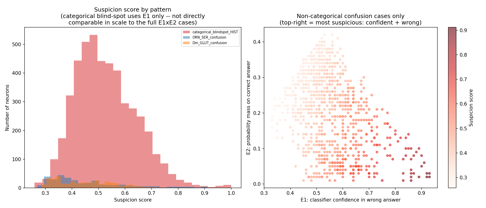

# Neurotransmitter Consistency Within Cell Types Across FlyWire Connectomes

Analyze whether neurons sharing a cell type label agree on their predicted neurotransmitter. The project combines entropy screening, cross-dataset comparison, confusion-signature matching, and literature validation to identify systematic classifier errors in FlyWire FAFB v783 and MCNS v1.0.

## Overview

The primary screen covers **402 FAFB cell types** with at least 20 labeled neurons. Two types, **R7 and R8**, exceed the size-corrected entropy threshold of z > 2. Both are photoreceptors with literature-verified histamine signaling, a transmitter outside FAFB's six prediction categories.

The broader analysis covers **702 cell types** with at least 10 members and identifies three patterns: a histamine category gap, serotonin predictions in cholinergic olfactory receptor neurons, and GABA/acetylcholine predictions in glutamatergic Dm neurons. Literature validation supports **5,387 proposed FAFB neuron corrections across 17 cell types** and **1 MCNS neuron correction**. A complementary confusion-signature scan identifies **4 additional cell types** with literature-supported prediction mismatches.

MCNS predictions provide an independent classifier comparison; literature evidence determines which candidates enter the correction lists. This distinction matters for **Lai**: MCNS predicts histamine, while literature verifies glutamate, so Lai is excluded from the histamine corrections. **R8** has verified acetylcholine and histamine co-transmission, so its acetylcholine predictions are accepted.


## Setup and data

Install the Python dependencies:

```bash
python -m pip install -r requirements.txt
```

The analysis uses pandas, NumPy, SciPy, Matplotlib, and scikit-learn; pytest runs the test suite.

Download annotation exports from [FlyWire Codex](https://codex.flywire.ai):

- **FAFB v783:** Neurotransmitter Type Predictions as `data/neurons.csv`, Cell Types as `data/cell_types.csv`, and Classification / Hierarchical Annotations as `data/classification.csv`.
- **MCNS v1.0:** Neuron Attributes as `data_mcns/neurons.csv`.
- **Connectivity analysis:** FAFB Connections (Filtered) as `data/connections.csv`.

For literature validation, download `gt_data.csv` from [flyconnectome/drosophila_neurotransmitters](https://github.com/flyconnectome/drosophila_neurotransmitters) into `data/gt_data.csv`. The database records verified neurotransmitters, source citations, and confidence scores. Dm9 uses direct literature evidence documented below.

Raw and merged annotation exports are gitignored. The repository includes analysis results, correction lists, and figures.

## Reproducing the analysis

With the input files in place, run the pipeline:

```bash
python run_pipeline.py
```

Use `--skip-connectivity` to omit connectivity analysis, `--figures-only` to regenerate the pipeline's summary figures from saved results, or `--validate-only` to check the saved results.

To run the annotation preparation and entropy screens individually:

```bash
python merge_data.py
python normalize_mcns.py
python analysis.py data/merged_annotations.csv
python analysis.py data/merged_annotations.csv --min-members 10
```

For the cross-dataset and literature checks:

```bash
python full_histamine_scan.py
python histamine_pattern_check.py
python general_scan_n10.py
python three_patterns_summary.py
python validate_against_literature.py
python build_corrections.py
```

The confusion-signature scan can run from the saved entropy tables without raw neuron annotations. It prefers the n>=10 table when available. Its literature annotations and correction export require `data/gt_data.csv`:

```bash
python signature_scan.py
python build_signature_corrections.py
python plot_signature_scan.py
```

Generate the per-neuron priority scores after building the correction lists:

```bash
python suspicion_score.py
python suspicion_score_mcns.py
python suspicion_score_plot.py
```

Validate the saved outputs and run the tests:

```bash
python validate_results.py
python -m pytest -q
```

## Methods

### Entropy screening

For each cell type with at least 20 labeled members, `analysis.py` computes Shannon entropy of the neurotransmitter prediction distribution. A stratified permutation null with 1,000 shuffles preserves the overall transmitter counts and each cell type's group size. The resulting z-scores measure inconsistency relative to this null; permutation p-values and Benjamini-Hochberg q-values provide significance estimates.

Permutation counts use a vectorized, flattened-index `numpy.bincount`. The n>=10 analysis applies the same method with broader cell-type coverage.

### Cross-dataset comparison

The histamine check selects MCNS cell types with at least 90% histamine predictions, matches them to FAFB, and compares their FAFB entropy with the full distribution. The general scan extends this comparison to any consistently predicted MCNS transmitter.

`name_matching.py` supports case/whitespace-insensitive exact matches and equivalent range notation such as `R1-6` / `R1-R6`. `mcns_matching.py` explicitly aggregates the R7/R8 photoreceptor subtypes and supports constrained subtype suffixes. Extrinsic Ring neurons (`ExR7`, `ExR8`) belong to a separate cell class and are excluded from photoreceptor groups. Names without a supported match remain unmatched.

### Confusion-signature matching

Entropy measures inconsistency, so it can miss a type that is consistently assigned the wrong transmitter. R1-6 illustrates this limitation: its 4,090 neurons are approximately 82% predicted acetylcholine, giving it a negative entropy z-score despite literature-verified histamine signaling.

`signature_scan.py` represents each cell type as a probability vector over FAFB's six output categories: ACH, GABA, GLUT, DA, SER, and OCT. It measures Jensen-Shannon divergence to literature-confirmed seed profiles for the histamine, ORN serotonin, and Dm glutamate patterns. Seed scoring uses leave-one-out comparisons.

`signature_calibration.py` calibrates each distance against other real, non-seed cell types. For a candidate and a pattern with k available seeds, let `q_close` be the fraction of reference profiles at least as close as the nearest seed, with an add-one-half continuity correction. The probability of at least one equally close match among k independent reference draws is:

```text
p = 1 - (1 - q_close) ** k
```

The scan selects the best pattern by calibrated p-value and uses p < 0.05 to generate candidates. It also reports within-pattern Benjamini-Hochberg q-values. These exploratory candidates require independent literature validation; geometric proximity alone does not establish a transmitter correction.

Calibration depends on the size and composition of the reference pool. Small pools limit significance resolution, and common acetylcholine-dominant profiles are less distinctive than rare confusion signatures.

`recovery_report` evaluates both signature matching and entropy significance. `entropy_channel.py` estimates the entropy channel from aggregated category counts using multivariate-hypergeometric sampling. R7 is detected through entropy even though its leave-one-out geometry is closer to the Dm pattern. R1-6's geometric evidence is suggestive (p approximately 0.07); its histamine classification rests on MCNS and literature evidence.

## Results

### Photoreceptors and the histamine category gap

In the n>=20 FAFB screen, the two z > 2 outliers are:

- **R7:** 474 neurons, entropy 1.625 bits, z = 7.55; dominant FAFB prediction GLUT (44%).
- **R8:** 475 neurons, entropy 1.376 bits, z = 3.47; dominant FAFB prediction ACH (58%).

FAFB predicts no histamine among its 139,255 neurons. Its classifier supports acetylcholine, GABA, glutamate, dopamine, serotonin, and octopamine. Histamine is outside that output vocabulary, as documented by Eckstein et al. (2024).

MCNS's R7 and R8 photoreceptor subtypes have 100% histamine predictions. The four types selected by the MCNS histamine comparison sit in the upper tail of FAFB's entropy distribution: R7 at approximately the 99th percentile, R8 at the 98th, Lai at the 97th, and R1-6 at the 93rd. Their mean entropy is 1.27 bits, compared with 0.16 across all 402 types.

Literature supports histamine for R7, R8, and R1-6. Lai's literature-verified glutamate contradicts its MCNS prediction. R8's verified acetylcholine co-transmission also means that not every non-histamine prediction is an error. High entropy is therefore a screening signal that requires transmitter-specific evidence.

### Broader patterns at n>=10

The sensitivity screen covers 702 cell types and yields 21 candidates across three patterns:

- **Histamine category gap:** R7, R8, Lai, and R1-6 are selected by the MCNS comparison; literature supports the photoreceptors and excludes Lai.
- **ORN serotonin confusion:** 10 of 53 MCNS-matched, cholinergic ORN types are predominantly predicted serotonergic in FAFB: ORN_V, ORN_VM3, ORN_VA2, ORN_DA3, ORN_DA4m, ORN_DA4l, ORN_DM2, ORN_DM3, ORN_DL4, and ORN_DL3. The other 43 are predominantly acetylcholine with near-zero entropy.
- **Dm glutamate confusion:** 7 of 13 MCNS-matched, glutamate-predicted Dm types are predominantly predicted GABA or acetylcholine in FAFB: Dm12, Dm16, Dm20, Dm19, Dm1, Dm6, and Dm9. Literature supports corrections for Dm12, Dm19, Dm1, and Dm9; the other three remain unconfirmed.

These results are recorded in `results/general_scan_n10_full.csv` and `results/three_confusion_patterns.csv`. Some candidates have only 10-17 FAFB neurons, and MCNS is itself a classifier output, so the screening results should be interpreted alongside the literature evidence.

### Confusion-signature candidates

The signature scan flags **28 of 702 cell types (4.0%)** as candidates outside the seeds and name-matched set. Literature comparison identifies:

- **4 prediction mismatches:** TmY16 (FAFB GABA, literature GLUT), vDeltaA_b (SER, ACH), WEDPN6B (GLUT, GABA), and hDeltaK (SER, ACH).
- **3 types whose dominant prediction agrees with literature:** Mi15, ORN_DM5, and PFGs.
- **21 types without a literature match:** listed in `corrections/signature_scan_novel_unconfirmed.csv`.

TmY16 and hDeltaK have direct entries in `gt_data.csv` citing Nern et al. (2024) and Wolff et al. (2024), respectively. TmY16, vDeltaA_b, and hDeltaK extend the confusion patterns beyond the ORN and Dm name families. WEDPN6B's literature answer differs from its matched pattern's expected transmitter; its correction is supported by the direct FAFB-versus-literature disagreement.

These cell-type findings are recorded in `corrections/corrections_signature_scan_novel.csv`, separately from the neuron-level, name-matched correction lists so each result retains its method of discovery.

### Connectivity and predicted transmitter labels

`connectivity_comparison.py` tests whether FAFB transmitter predictions correspond to connectivity structure. It builds normalized output profiles over the top 30 downstream partner types, using connections with at least five synapses, and compares within-label and between-label similarity with 2,000 permutations.


- **R7:** 473 neurons; within-label similarity 0.557 versus between-label similarity 0.494, p < 0.0005. Cross-validated label prediction from connectivity reaches 54.1% accuracy against a 44.7% majority baseline.
- **R8:** 474 neurons; within-label similarity 0.726 versus between-label similarity 0.716, p = 0.095. Classifier accuracy is 58.0% against a 58.4% majority baseline.

R7's transmitter predictions correlate with wiring variation. This is consistent with anatomical subtype structure, but the FAFB analysis lacks direct subtype labels to establish a particular correspondence. R8 shows no significant connectivity association in this test.

## Literature-supported correction lists

The 21 name-matched candidates comprise **17 literature-supported types**, **1 contradicted type (Lai)**, and **3 unconfirmed types (Dm16, Dm20, Dm6)**. Each neuron-level correction includes the predicted transmitter, verified transmitter set, source citation, confidence, and proposed action.

- `corrections/corrections_fafb.csv`: **5,387 neurons across 17 cell types**.
- `corrections/corrections_mcns.csv`: **1 neuron, in Dm9**.
- `corrections/excluded_unconfirmed_candidates.csv`: the four excluded or unconfirmed types.
- `corrections/corrections_signature_scan_novel.csv`: the four additional cell-type findings from signature matching.

R8 neurons predicted acetylcholine are excluded from corrections because both acetylcholine and histamine are verified. Lai is excluded because its MCNS histamine prediction conflicts with literature-verified glutamate.

**Dm9's evidence comes from direct literature sources:** Kind et al. (2021), *eLife*, [doi:10.7554/eLife.71858](https://doi.org/10.7554/eLife.71858), and Schnaitmann et al. (2024), *Frontiers in Molecular Neuroscience*, [doi:10.3389/fnmol.2024.1347540](https://doi.org/10.3389/fnmol.2024.1347540). These support glutamatergic signaling. All 179 FAFB Dm9 neurons have incompatible predictions (178 ACH, 1 GABA) and are proposed for correction to GLUT. Dm9 is absent from the project's `gt_data.csv` snapshot, so this evidence is recorded as a direct literature match.

## Prioritizing manual review

`suspicion_score.py` ranks FAFB corrections using the classifier's confidence in its prediction (**E1**) and its probability support for the literature-verified answer (**E2**). E2 is available where the correct answer belongs to FAFB's six output categories.

```text
suspicion = E1 * (1 - E2)   when E2 is defined
suspicion = E1              for categorical blind-spot cases
```



High scores identify confident predictions with little support for the verified answer. For example, some ORN_DL3 neurons have greater than 90% confidence in serotonin while acetylcholine receives only a few percent support. MCNS scores use E1 alone because its export lacks per-category probabilities.

The score is a review priority, not a calibrated probability of error. The 4,564 categorical blind-spot cases average 0.53, while the 823 full-formula cases average 0.44; part of this difference follows from the formulas themselves. The `score_type` column identifies the formula used for each row.

Outputs are `corrections/corrections_fafb_scored.csv` and `corrections/corrections_mcns_scored.csv`.

## Reference

Eckstein, N. et al. *Neurotransmitter classification from electron microscopy images at synaptic sites in Drosophila melanogaster.* Cell (2024). [doi:10.1016/j.cell.2024.03.016](https://doi.org/10.1016/j.cell.2024.03.016).

Data: FlyWire Codex, FAFB v783 and MCNS v1.0. See [FlyWire Codex](https://codex.flywire.ai) for dataset access and citation guidance.
